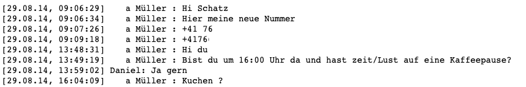

# Text generator which reads in large .txt files, trains a LSTM model on it and outputs text in similar format.
## The model is trained with the help of SCUDA and on a Nvidia Geforce Gtx 1060
<p align="right">
 
 </p>

The model uses the following parameter
num_hidden=512,
num_layers=3,
drop_prob=0.5,
use_gpu=True

I tested the model on different datasets. Some models converged quickly, some not at all.

# 1. Counties in Germany with GPS codes (n=11088 couties)
Epochs to trained = 35
Batch_size = 128

### Input
<p align="left">
 
 </p>
 
 ### Output
 <p align="left">
 
 </p>
 
### Description
The model was trained on the Names, Latitude and Longitude (all in one string) of German counties. 
Supprisingly, the model, which is build to predict character by character (not words), learns the structure of the text and spits out an arbitrary number of fake counties with GPS codes. 

### Considerations
For this to work, the text had to be shuffled using a simple:
```
import random
random.shuffle(words)
```
We do this to avoid the model to only predict counties that start with the letter "A".

Training time: --- 543.0422582626343 seconds ---


# 2. WhatsApp Chat History 
### (n=40908 WhatsApp Messages, between 29.08.14 - 15.9.2019)
Epochs to trained = 
Batch_size = 

### Input
<p align="left">
 
 </p>
 
 ### Output
```
Daniel: Wie die schlechte auf
...a Müller : Da keine Somen die Schatz 
...a Müller : Dann ist dir gestimmt den Schatz 
...a Müller : Danke ich mir die sorlen den Meinen?
Daniel: Bis gut in Schatz
...a Müller : Heit
...a Müller : Heh ich mich dann suer mich auch auf dir aber
...a Müller : Dass den Schatze Schatz 
...a Müller   Dier schon die schlacht
...a Müller : Ich dir den Sonnen ich dass sorte mit gerauten sorer ist dann den Stard
...a Müller : Ich hieb dich auch
...a Müller : Hit ist der Stit mal dich so guten Schatz
...a Müller : Hi Schatz weißen dir an mal in schöchen?
Daniel: Hab schön schönen Stutz
Daniel: Hie ich dann schot schon auch sehr suesse
...a Müller : Dann ich mal dir gut aber die Bein die Schatz ist dass auch aber schlecht
...a Müller : Hab die so gerne auf die so sehr
...a Müller : Dann da kannst
...a Müller : Hab das dann somme die Schot
Daniel: Heute mit
Daniel: Bin so schon so sein
Daniel: Bin gut aus dir ganz dass du bist du dir gehalt
```
(I replaced my wife's first name with "...a". Everything else was created by the machine.)

### Description
The model was trained on my wife and mine WhatApp chat history of about 5 years. The model is able to produce the format you find in WhatApp, output some German words, however is not able to generally produce meaningful sentences (few excpetions).

### Considerations
At the beginning, whatever I did, my model did not converge. The main reason was the amount of characters to be encoded. The model thought of each emoticons as of a characters. I endet up with 733 options for the algoritym to choose from, when picking the next character. Removing the emoticons reduced the space by approximately 85%, while keepting the text readable.

<p align="left">
 
 </p>

```
TBD
```


Training time: ---  seconds ---


