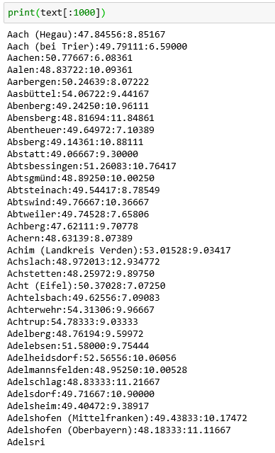
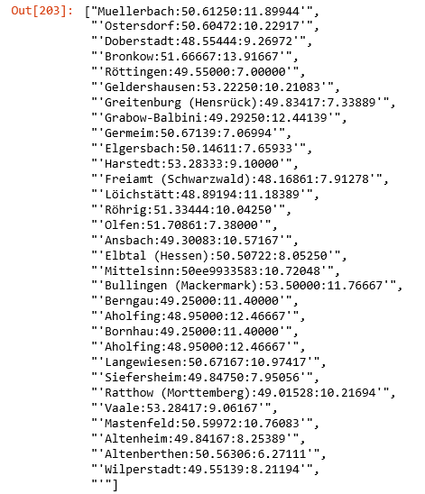

# Text generator which reads in large .txt files, trains a LSTM model on it and outputs text in similar format.
## The model is trained with the help of SCUDA and on a Nvidia Geforce Gtx 1060
<p align="right">
 
 </p>

The model uses the following parameter
num_hidden=512,
num_layers=3,
drop_prob=0.5,
use_gpu=True

I tested the model on different datasets. Some models converged quickly, some not at all.

# 1. Counties in Germany with GPS codes (n=11088)
Epochs to trained = 35
Batch_size = 128

### Input
<p align="left">
 
 </p>
 
 ### Output
 <p align="left">
 
 </p>
 
### Description
The model was trained on the Names, Latitude and Longitude (all in one string) of German counties. 
Supprisingly, the model, which is build to predict character by character (not words), learns the structure of the text and spits out an arbitrary number of fake counties with GPS codes. 

### Considerations
For this to work, the text had to be shuffled using:
```
import random
random.shuffle(words)
```
We do this to avoid the model to only predict counties that start with the letter "A".


